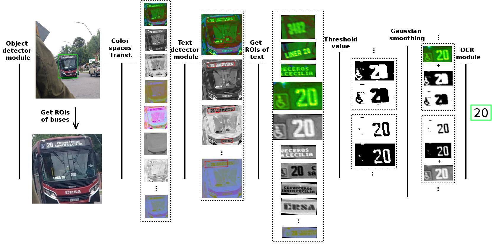

# Bus-Line-Number-Recognition
[[Paper]](https://49jaiio.sadio.org.ar/pdfs/asai/ASAI-10.pdf) [Colab] [[Video Demo]](https://www.youtube.com/watch?v=DeLpJ9ud7p4)

<p align="center">

</p>


The goal of this project is the exploitation of computer vision techniques and the analysis of images for the generation of a tool that potentially allows people with visual impairments to be assisted. To achieve this, a modular architecture based on object detectors and optical character recognition is presented and evaluated, mainly constituted by two stages: one for the detection buses, based on the SSD-MobileNet object detection model; and another, responsible for line number recognition, where the EAST and OCR-Tesseract text detection and recognition models are tested, respectively. With a maximum probability of recognition of 62\% in a simple image; over an image sequence, the final system was able to correctly recognize the bus line in 72\% of the cases.

For more information, please refer to our paper: [Stop the Bus!: Computer vision for automatic recognition of urban bus lines.](https://49jaiio.sadio.org.ar/pdfs/asai/ASAI-10.pdf)

## Install
```
git clone https://github.com/nanom/Bus-Line-Number-Recognition.git
conda create -n myenv python=3.6
conda activate myenv
pip install -r requirements.txt
```

## Usage
It has three modules to be able to run the detection system. Detections can be done using four different models: YOLOv2, SSD-MobileNet, YOLOv3 and YOLOv3-tiny (`--help` for more configurations)

* `short_pipeline.py:` Given a sequence of images, give notice of the arrival of the bus, when the first detection of the expected line number occurs.
* `long_pipeline.py:` Given a sequence of images, it gives notice of the arrival of the bus, if at the end of the processing of all the images of the entered sequence, the expected line number is detected.
* `real_camera.py`: Recognition in real time through a camera device.


```
python short_pipeline.py -i test_images -m mobilenet -n 66
```


## Stages of buses line numbers recognition
1.  Bus detection stage
<p align="center">

</p>


2.  Line numbers  detection stage
<p align="center">

</p>

3.  Line numbers recognition stage
<p align="center">

</p>

## Reference
```
@inproceedings{maina2020stop,
  title={Stop the Bus!: computer vision for automatic recognition of urban bus lines},
  author={Maina, Hern{\'a}n J and S{\'a}nchez, Jorge A},
  booktitle={XXI Simposio Argentino de Inteligencia Artificial (ASAI 2020)-JAIIO 49 (Modalidad virtual)},
  year={2020}
}
```
