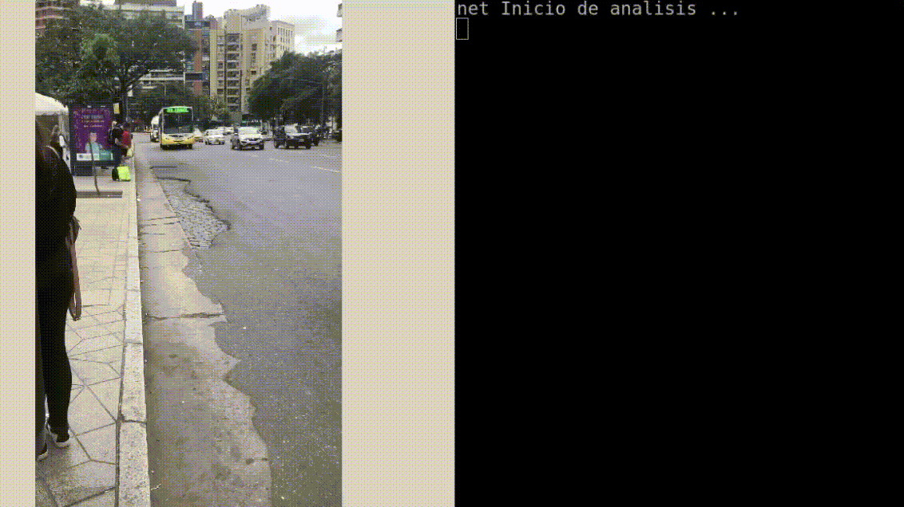

# Bus-Number-Recognition


## Install
```
conda create -n myenv python=3.6
conda activate myenv
pip install -r requirements.txt
```

## Usage
It has three modules to be able to run the detection system. Detections can be done using four different models: YOLOv2,Sss MobileNet 300, YOLOv3 and YOLOv3-tiny (`--help` for more configurations)

* `short_pipeline.py:` Given a sequence of images, give notice of the arrival of the bus, when the first detection of the expected line number occurs.
* `long_pipeline.py:` Given a sequence of images, it gives notice of the arrival of the bus, if at the end of the processing of all the images of the entered sequence, the expected line number is detected.
* `real_camera.py`: sages in real time through a camera device.


```
python short_pipeline.py -m mobilenet -i test_sets/set11/ -n 66
```
<center></center>

<!--  -->

## Stages of buses line numbers detection
1.  Bus detection stage
<center></center>


2.  Line numbers  detection stage
<center></center>

3.  Line numbers recognition stage
<center></center>

## Reference
```
@inproceedings{maina2020stop,
  title={Stop the Bus!: computer vision for automatic recognition of urban bus lines},
  author={Maina, Hern{\'a}n J and S{\'a}nchez, Jorge A},
  booktitle={XXI Simposio Argentino de Inteligencia Artificial (ASAI 2020)-JAIIO 49 (Modalidad virtual)},
  year={2020}
}
```
